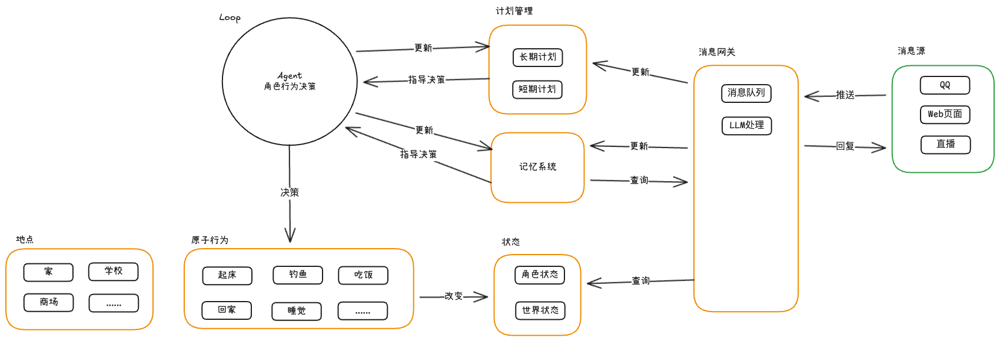

  

    
世界观

    <h2>她不是为了完成任务而存在，而是在认真过自己的日子。</h2>
    

      <strong>ゆいじゅ（悠酱）</strong>
      不是一个站在输入框另一端等待命令的助手。她会起床、出门、犹豫、选择、留下记忆，也会在没有人打断的时候继续把今天过下去。
    

    

      这个项目尝试做的，不是给角色拼出更多技能按钮，而是给她一个可以持续运转的世界，让行为、时间与状态自然地连接起来。
    

  

  

    

      世界时间
      <strong>持续推进</strong>
      
不是一问一答，而是会一直往前走的日常。

    

    

      决策方式
      <strong>基于当下状态</strong>
      
让选择来自此刻，而不是来自预设台词表。

    

    

      记录方式
      <strong>留下轨迹</strong>
      
行为历史、状态变化与记忆可以被回看与复盘。

    

  

  

    
生活节奏

    <h2>她的一天，不该只是对话窗口里的几轮往返。</h2>
    

      早上在家里磨蹭，下午去学校，路过咖啡店时临时起意进去坐一会儿，晚上回到房间整理今天发生的事。
      一个角色真正鲜活，来自这些连续的小决定，而不是一串堆叠出来的能力描述。
    

  

  

    
一个 tick 里会发生什么

    <ol class="tick-list">
      <li>
        <strong>读取状态</strong>
        从 Redis 取出角色当前所处的地点、时间、需求与上下文。
      </li>
      <li>
        <strong>收敛可选行为</strong>
        根据场景和前置条件筛出此刻真正可能发生的事情。
      </li>
      <li>
        <strong>让 LLM 做决定</strong>
        不是死规则拍板，而是由模型判断这时候更像她会做的选择。
      </li>
      <li>
        <strong>执行并留下痕迹</strong>
        状态被更新，历史被写入，时间继续向前推进。
      </li>
    </ol>
  

  

    "不做 AI 助手，做一个有自己生活的人。"
  

  

    
世界结构

    <h2>技术实现服务于生活感，而不是反过来。</h2>
    

      world 引擎负责 tick、行为筛选与执行，Redis 保存实时状态，MongoDB 沉淀行为历史。
      架构的目标不是把系统堆得更复杂，而是让角色的日常能连续、可信、可追溯地发生。
    

  

  

    
  

